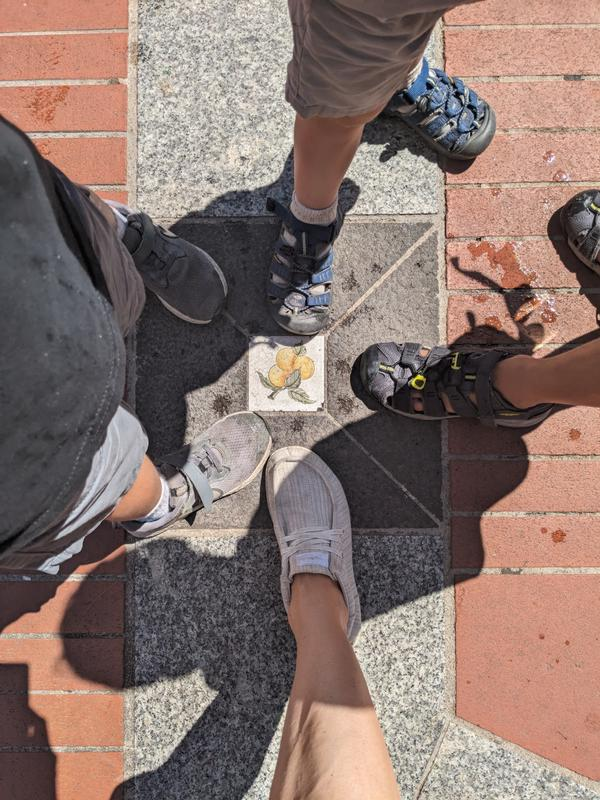

This was a bit of a forced day. We had a big walking day the day before (around Nice) and were 2 days post trans-Atlantic flight, but it was really our only day to go to Monaco…and I was so curios to see it. We took a hot and crowded bus there and went straight to the central market for food. Kids found a playground and Dan and I were able to sit and drink a coffee in the plaza and be close enough to see the kids. It was lovely.

In the plaza were cute tiles with all different fruits and vegetables. Some running around trying to figure out what they all were.

We found pizzas for the kids and Dan got a sardine sandwich, which 2 of the kids tried and loved. Sam talked to some strangers.

After lunch we were on a mission to find a hidden beach by the parking for the aquarium. We went up, by the palace, down, through the stunning gardens, down more, through the parking and found the most amazing beach…that was closed do to failing railings on the steps down. 

The unatainable beach.

We were a bit gutted but kids didn’t seem to mind as we found a concrete pier to jump off just a bit further. Not as fun for the parents as the waves were quite strong and I didn’t want more than one kid/parent in the water at a time. Still, kids LOVED it.

Then some more walking up, ice cream, walking down, weaving through streets and we decided to call it. It was so excruciating hot and we were so ready to be out of the sun. 

I was amazed how clean and perfectly kept everything seemed. Even the public bathrooms looked lovely (from the outside…I didn’t go in). 

The streets almost looked like something out of a Dr. Suess book…colorful and weirdly winding around.

And some cool buildings that looked like they were designed to match the waves from the sea. I love pointing these things out to the kids, but we were so hot and tired on the last 3 block stretch to the train that no one seemed to care.

Train back was easy and of course the kids loved being on the upper level of the train. It really is the little things that make them so happy. And the fact that we were clearly on the wrong end of the platform when the train pulled in and we had to run, no sprint, to make it to the train. I was in front with Ben and Sam and I’m not sure if Max ran or was just flying behind Dan, holding on desperately to his hand. 

Bus once we got to Nice and since we still weren’t cooled down, we jumped in the pool at our place. Again, very happy kids from just a little thing. Mark and Shanya brought over a salad and pasta and we had another lovely al fresco dinner. Kids crashed hard.

The final #s on my watch were 80 flights of stairs and 20k+ steps. Max got carried some, but the other 2 were champions.

