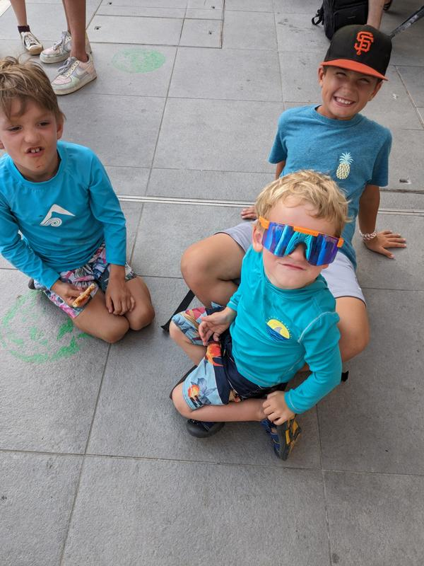

When your good friend from high school is in Florence and you are in Genoa at the same time, how do you not meet in the middle in Cinque Terra? We planned to take the direct 9:54am train but when we got there to buy tickets, it was sold out! We would have had to wait an hour and had a transfer. If we weren’t meeting up with Rona and family, we would have just postponed for another day. But we were, so I bought tickets for the next train and decided to hope for the best and play dumb as needed. 

The train was pretty full and we only got 2 seats. Eventually we got 4 together for a bit, did some bubble blowing practice, until a woman said we had one of here seats. 

I didn’t even know in this class you could pick seats! Max moved to my lap, even though the woman was so sweat and offered for him to sit between us. Then 2 stops from the end, I saw a ticket lady! Ready to dumb it up and whisper to Sammy to start crying. The ticket lady asked the woman next to us for her tickets. The ticket lady questioned the 7 tickets on her phone and she (passenger) spoke English only and said there are more ahead on the car. And then what? The ticket lady moved on!!! She assumed we were some of the 7 and never came back to check when other people said they were the other 6! I felt like a spy that just got away with something cool. 

We got to Monterrosa di Mar and walked about 50 steps to the beach. Rona and family were there already and had got an umbrella and 2 chairs. The beach was beautiful, but so rocky and painful. Rona’s 11 year old daughter adored Max and watched him most of the time. 

Sam, Ben and JJ (9yo) never stopped playing. And when they needed extra excitement Sean (Rona’s husband) tossed them around in the water, but not before bringing Rona and I Aperal Spritzs. It was magical…but so hot!

We snacked and then found a lunch spot that was kind cool…and 2 more Aperal Spritzs each. Then we got gelato as promised as Sean went to check the ferry schedule; just to see if it was possible to take a short boat ride to the next town. 

The plan (2 months ago) had been to hike a bit, but not in this weather at this time of day. Rona got a call from him and he said ‘run!’ Run we did! Ice creams in hand we sprinted over there and made it. Max was not clean by the time we got there, nor was my shirt. But is he ever? 

The sea breeze felt great, but nothing could shake the constant heat feeling…well except jumping in the sea. As we pulled into the dock, there were rocks off to the right people were jumping off. And we were already so hot again, so why not? There was no beach, so it was a bit of juggling for the jumping. Everyone did it! Sam jumped from the higher up area and got a huge applause. Max had to jump too, did it from about 1 foot and got a huge applause too. Then some floating around and walking around the town. 
Happy kids after they all got to jump and cool off, temporarily.

And of course we made all the kids line up in descending order for a final group photo.

We all took the train to the Riomaggorie,

 

got food for the train and then caught the train home. 

Kids were so sad to leave new friends and Ben was emotional on the train. I think playing with a kid his age made him really miss his friends. Cookies to keep the kids from losing it and then taxi home this time.

I think meeting up with friends during this year long trip is going to help us a lot. It was such a special day to spend with Rona and her family, especially when we only planned it the day before.

And a couple more photos from the day

