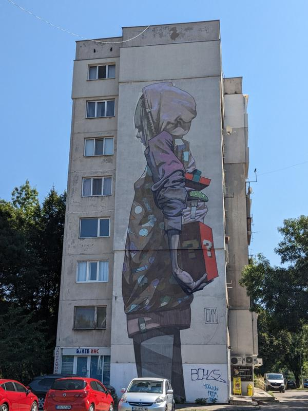

We settled into our Airbnb and decided to run a couple errands before our friends were arriving the next day at 10am. Ben needed shoes so badly…his trusty Keens were holding up well, but were also a bit smelly. If by a bit, I mean very! We had washed them a few times, but didn’t seem to do the trick for long. We headed out towards my favorite kids’ store, Okaidi, which was located on a pedestrian walkway. 

Being the end of the season, there weren’t many shorts to but I did get some pants and the next size up underwear for Sam…which is the same as Ben. 

The nike store didn’t have his size in any style that was mom acceptable and Ben acceptable, so after wandering a bit more looking, we headed back empty handed. Kids needed to run around a bit, so we headed to a close park and I got us street food to eat in the park.

A pretty easy travel day as they go, but the kids still were wiped out...as were we too.

The next morning, we figured out pretty early that Ben, Laura and Ember (the Allreds) were not going to make their connection in Zurich due to a delayed flight from Chicago. Dan of course had a comment about how ORD is the worst airport to fly through. They were now not going to land until night time, so we planned a chill day of fun things to do, but not the top sights that we knew we’d see with the Allreds. This basically meant wander around and find parks.

We headed towards a big green area for cooler temps and parks.

Wandering around lots of things were reminding us of big European cities…I felt that way the day before on the pedestrian street with Ben. I think after traveling outside the EU for so long, we forgot that Bulgaria was in the EU and never was a part of Yugoslavia. A different feel all around for sure.

We found a great playground, did some kid reading and I got a banana/Nutella crepe…my favorite.

After a while of playing and too much sun, we got some lunch and watch the pole vaulting part of the decathlon in the World Championships.

And Ben and I found a cool map of the world. And anytime Ben can point out where the Pyramids of Giza are, he's stoked.

It wasn’t a busy day, but there was a lot of walking and a lot of playing, so we headed home after our late lunch. Speaking with Laura, it looked like they were confirmed on a flight to get them in around 9pm. This would mean 4 flights and 30+hrs of travel by the time they arrived. So brutal!

We had walked past a restaurant with sushi that the kids were bugging us to go to. To be fair, we did 8 weeks without sushi once…I’m surprised my kids survived. Actually, over all we did 8 weeks of eating local food. Yes at home we would make pasta, but out we delved into ALL the local foods, sometimes ordering things we had no idea what they were. And the kids at about 95% of it. It was kinda amazing.

Anyways, we got to the restaurant and we probably waited about 30 minutes too late to eat. Sam was losing it (actually lost it on the way and almost didn’t come), but it was all order by phone so we were able to get food coming quite fast. I have never seen all three kids consume food SO fast. Dan and I too actually. Super yummy and different rolls than we had had before. It was nice to have something that felt like home…yes sushi feels like home.

I headed to the airport around 8:30pm, just to be 100% sure I wasn’t a second late. Well, no issue there, as the airline lost 3 of the 4 bags and they were held up dealing with that. It was so good to see them walk out of the arrivals doors. They were so tired and I’m sure I was obnoxiously bubbly. And being the amazing friend I am...even though I was so tempted...I did not take a photo of the weary travelers. :) Finally, we headed back to our Airbnb. 

Easy taxi ride, especially with barely any bags. We got there, showed them their rooms, which we had placed some weird vitamin/drug in increase your libido…for men and women! It was in a drawer at the Airbnb when we arrived and on the back of the box, the only English words were ‘horny goad’. What could be wrong or gross about that? 

We also gave them wine and chocolate cookies, which I asked for back the next day…well not asked for back, but asked if we could all share them and then eat half the box. 

We had breakfast the next morning with Big Ben reminiscing a bit about some of the foods he had eaten from when he lived there before. Mental note was made to try all of them. For the day, we decided to head Hadji Dimitar District with a ton of street art that Ben had mentioned. Google informed us to take the metro, and just that was an event. As we went down the escalators and the guys tried to figure out tickets, we looked around at some ruins. I guess they found these ruins when excavating for the Metro and preserved them. Kinda a 2 for 1, ruins and metro ride. 

After walking around the ruins for a bit, we found our train and took it to what we thought was our stop. With kids seemingly always inching their way to the tracks, the glass barrier was kinda awesome!

 We were one stop early, so back on the train. We popped out and started looking for art. Somehow first we found a playground where the kids played for a few minutes…trying to save playing for when we were at a low point...but had to give them a few minutes.
 
 
 
 We made it about 5 minutes further where we saw a café with a playground attached and well, can’t argue with the logic in that. Dan and I caffeinated up and Ben and Laura got lemonades. All was well until Sam took a decent fall. All calm finally and we headed out looking for art. We found our first one and it was so huge and cool!
 

 We wandered as the guys tried to actually point us in the right direction, Big Ben chatted with the locals and we saw some cool and gigantic art on buildings. Mind you, this is probably a 6 story apartment building. 
 
 

We couldn't get enough...we all loved it. We talked about what we thought they meant and kids opinions never cease to amaze me. :)

Adults talked more about how they came to be. Did the neighborhood commission them, or did artists do them to get their stuff out there? And the scaffolding to get it painted...and really just how did they do it?!

 
 
 Kids were doing great with some snacking, but it was getting hot and we had been walking for a bit. Ben had found a restaurant to go to…got good reviews and part Rakija bar? 
 
 

 Food was great, had some local beer and when the kids hit their limit, I took them to the park across the way and skipped (bummer!!) the rakija tasting. The playground was in the sun and hot, so the kids decided to collect leaves and slide down through them, because why not? This went on for quite a while, with only minor discussions about how/when/etc for the pile before sliding through it. 
 
 

 Everyone caught up with us, Dan filled water bottles and we found a tram that would take us back home. Ben got a call that they had a suitcase, so he and Dan raced back to be there in time and Laura, I and the kids went to get gelato. It was quite close to our place and with a quick grab of the suitcase, the guys were able to meet back up with us. 
 
 
 
 Not a big day, but felt long with the heat and I can’t imagine how tired the Allreds were. We headed back and the boys enlisted Ember in their elaborate Ghost Getter game. Ben and Dan had signed up for a walking tour, so they headed out a little after and Laura and I hung out, made dinner for the kids and let them play more. Early bed for the kids and we relaxed with beers waiting for the guys to get back.

The tour was a success and we sampled more beers (I had grabbed a selection from the store) as they told us what they learned.

Big Ben was up and out early, coming back with lots of food options. We sampled them all as we figured out the plan for the day. There is a very old church (yes, it is Europe after all) that has well preserved frescos. Looking at the rock patterns on the exterior, you could see the difference in age that each part of the church was built.

 The church was at the base of a hike we wanted to do, so it made sense to do these two things today…and we are all nature lovers, so it is always nice to escape the concrete jungle of the city. Boyana Church was very old and after getting tickets to see the frescos, we were told it was a 30 minute wait. The kids were bouncing, so grabbing coffee and letting the play on the playground we just passed made sense. 

Back at the church, we waited a few minutes and then headed through a small steel/wooden door to the inside. 

Half of the inside was a small museum of sorts with old things excavated from the site and the other half had the layers and layers of frescos. We were allowed 10 minutes total inside. Pretty similar to seeing the last supper in Milan years ago. 10 minute time slots and then you are out. It was small, so we felt we had time. There was a bit of stress inside, worrying a kid would touch the frescos that were barely guarded by small rope at ankle height. And no photos allowed of the frescos.

There were old coins and old books that had stayed intact well enough for Big Ben to read a bit to us. So crazy!

Ben liked the chain mail.

After the church, loaded with snacks, lunch and water, we started up a steep accent to the waterfall. It couldn’t have been more pleasant…completely shaded with the sound of running water for a lot of the hike up. 

It wasn’t easy, but we made it. So many steep parts and it was longer than we had though…according to Laura’s garmin watch…which is always right. The water was freezing, but the kids walked around and played in it. 

We had a great picnic lunch and introduced the Allreds to our trusty Nutella/bread snack and the loved Macedonian Smokies that we still had from Skopje. 

After the kids got their heads dunked in the water...not sure how this started, we packed up and started down. 

We took the longer route down that was less steep, but we all still managed to get grabbed by the ground goblins a bit. Kids were awesome hikers...at some points it seemed the adults were struggling more than the kids.

By the time we were at the bottom, we were done. Dan’s on his phone saying ‘there’s a bus in 5 minutes!’ but Laura and I shared the same thought…45minutes on a hot bus with the kids in their current state did not sound fun. We waved as the bus went by and Ben started calling for taxis. We knew it would be a bit so we headed back to the kiosk we had gotten coffees at and Dan treated the kids to ice cream and Laura treated the adults to beers. Win-win! 

I was about half way done with my rather large beer when we saw a taxi fly by! Chugged beer, yelled for kids and ran to the church where the taxi was meeting us. Tired and fulfilled, we enjoyed an easy ride back home.

I did some research in the taxi and found a place for dinner. It passed my test of good reviews, but more importantly…nice looking outdoor seating. At home we all took bathroom showers…the faucet for the sink was also the shower head. Loaded up my purse with pencils and paper to occupy the kids at dinner and walked the 8 minutes to the restaurant. It was a total gem! We had a big picnic table outside with plenty of table space for the kids to work on their ‘plan’ to get the ghosts. We ordered some appetizers that were amazing…some yogurt spread with pickles in it, crumbly bread with rosemary butter and a few others. We saw a lot of green drinks on peoples’ tables and we found out they were beer. Yes please! I call it 'heathy beer'.

A little like a pilsner, a little like a cider, a little sour I guess. Yummy, either way. And when the kids are all coloring and keeping to themselves, the beer tastes even better.

Good food all around.

Ben saw there was fish soup on the menu, he had to have it.

The only problem was it was so hot he couldn’t even start to eat it for about 10 minutes and being so big, he, Laura and I hung around after everyone left so he could finally get the last drop down. He’d probably pick sushi still, but fish soup might be a close 2nd for his favorite food.

Back at the place, the guys had the kids reading and almost in bed.

Easy bedtime after that and the adults stayed up sampling more beer and wine. We laid out our plans for the next day and headed to bed.