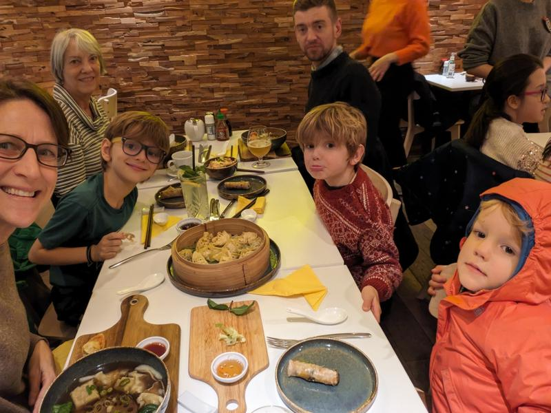

It was a glorious reunion with lots of hugs, even with an exhausted grandma and dad.

We thought they were going to get in after us, but turns out they both landed into Frankfurt early and I mentioned, ‘why don’t you check if your tickets allow for riding on the earlier train so you don’t have to wait around 2 extra hours.’ Well, they wouldn’t have, but their train was canceled, so now they can! Dan had a massive duffle bag with a lot of overflow from Turkey. Even weighed down, they were able to get on the train AND get seats, thanks to a friendly train conductor.

We walked out of the station to find taxis. 3 in each cab and we were on our way to our Airbnb. I was a bit nervous about this place as it had all good reviews and one TERRIBLE one. It was on the cheaper side, even though amazing location. Easy to find and apart from very steep stairs, it was so perfect! The upper level was one giant room with kitchen, dining area and big living area and the 2 bedrooms and bath were downstairs. We loved it. We took a bit to kind of settle in, then headed out to check out the Christmas market that was a whole 100 meters from our front door.

I had reservations about coming to this area because of the cold for the holidays, but just one night all walking around together and seeing ALL the decorations and festivities, I knew it was the right call and going to be wonderful. Kids feel no cold and were loving it already...and were happy to have Dad back.

There was a big Stella Artois tent in the middle with some serious goals for folks. Hopefully you can spread this over a few nights?

For our first night all together, it seemed right to get giant sausages and beer for dinner. Ben ate a whole one, while I could only finish about 2/3. They really were huge.

There were a few rides, but we told the kids we’d be back 2 more nights and there was so rush. We did have to get a couple waffles when we passed a stand. We figured we really needed to try them as much as possible so we could judge accurately.

Even though our travel wasn't bad, Dan and Tara had had quite the day(s), so we headed back for some chill time. Kids were into some cuddling and reading.

By now, Tara was 10 on the tired scale, Dan a 9, kids a 6 and I was a 1. Tara and the kids went to bed and at 8pm Dan was ready to go to bed. I’m all for an early night once in a while, but I knew that was too early for me. Wanting to know what all the hype was and have my own opinions on it, I watched The Barbie Movie. I’m all for girl power, but I just couldn’t with the movie. I had to skip some just to make the end come faster.

Loving these dark mornings where the kids sleep in. Dan and Sam ran to the market to get food and we had a lazy breakfast of eggs and peppers, with double doses of coffee. Thinking this was our best day for weather, we headed out in the direction of the Grand Place. We walked through the Christmas market (closed now) to get there, just to have a walk without cars. Max has been loving finding his name anywhere.

It was cold, but we were feeling pretty good bundled up and following our trusty guide. VERY good to have him back. :)

Always something to see on the way though in cities like this. We didn’t get far and we found the Bourse de Bruxells, the old stock exchange building that had a very cool interior. Dizzying looking up so much, but it’s hard not to.

We walked through and back around to the front where we saw an old church with stained glass. Not a fan of religion, but love when churches are decked out in stain glass. No photos allowed inside.

It was fun to just walk around as every store, every building, every square was decorated for the holidays. I am pretty much a grinch when it comes to Christmas, but this felt magical, even for me. We continued and made it to the Grand Place. Not at all what I was expecting. I was expecting all colors, but the buildings were more or less gray/concrete color with very bright gold details or they were decked out in a million intricate concrete statues...and I mean a million. Very stark contrast to many other European squares I have seen. I didn't take a zoom in photo of all the statues, but they are there...just small in this photo

And if a building wasn't covered in all the statues, it was decked out in gold statues/detailing and was very bright! Almost a double take as you walk into the square and see it. Doesn't show up well in the pictures, but trust me, it's there.

I somehow missed taking a photo of the giant Christmas tree in the center. We continued on the mini tour Dan was leading us to an old covered mall, that is now basically 'Chocolate Alley'. 
 

It seemed each store was trying to out do the one before. Chocolate chandeliers, chocolate fountains, chocolate Christmas everything you can imagine. Very well decorated and very fun to see.

And if all that wasn't enough, we walked out into what seemed like 'Waffle/Dessert Alley!' again, with each trying to out do the other.

It was starting to sprinkle and caffeine was wearing off, so we went to a cafe for coffee and hot chocolate. Kids were already bouncy, so we got one for them to share and good thing! It was huge. We had a couple fun rounds of Write-Draw-Write and waited for the rain to pass.

Continuing on our tour, more waffles of course. Not going to lie, it was hard to not get a couple a day. If only my children could not turn so crazy with sugar, maybe we could have. We walked to the fountain of the little boy peeing. A bit underwhelming, but I knew he was little. He also had so many clothes on, you could barely see the actual statue.

The rain didn't really want to let up, so we decided to head back to a chocolate museum we had passed before. Well done, talking about the origins of chocolate and showing the full process of plant to eating. Kids loved the audio tour that we each had and could hold it up to the scanner and start it themselves. Traditional chocolate milk frothers/mixers.

And the proof we have always wanted...chocolate IS good for you. Now I just have to find the beer poster.

We kept winding through and finally made it to the part where the chocolate is now edible. There were 5 different ones to taste. Kids had some restraint, but kept asking for more. We seemed to land on a happy middle ground. They ate a lot, no one had a sick stomach.

At the end of the tour was a presentation on how to make filled chocolates, and surprise surprise, you got to taste the final product. No pictures allowed during the presentation, but very happy kids after. And happy parents/grandma as the chocolate was very good.

With stomachs full of chocolate, it seemed like a great idea to go get some fries for lunch. Not my best decision, but I had not been in Belgium for 5 days and had not eaten fries yet! We got 2 larges, thinking they wouldn't be THAT big, but they were. One with ketchup and one with Belgium mayonnaise. It started to rain again, and not wanting soggy fries, we attempted to stay dry under the overhang.

That lasted a bit, but when we were almost done, we started the walk home. About 10 seconds after this photo, Max tripped and it all went flying.

And a picture 10 minutes later to show that the weather is crazy here. Rain, blue skies, mist, wind, rain, clouds, repeat.

It was a lot of walking overall that morning/afternoon and down time was needed. A couple naps were had and some reading and journal writing by others. I ran out to grab a few more snacks and to check out the beer selection. Much to my dismay, when I got home I realized I had bought a 0.0% beer. They really need to label those better! Flashing lights, neon sign? Beer for adult snack and cucumbers and tomatoes for kids snack...and the sausages and fries diet we had the last couple meals out was strongly lacking in the vegetable column.

After the snack/veggie consumption, we headed back to the Christmas market. Our street was decorated too...not sure if they are supposed to be lighted jellyfish, but they sure do look like them.

The market was substantially more crowded tonight. My theory was Friday (tomorrow) was a day off and everyone was celebrating even more with no work the next day. Who knows, but it's fun to have theories.

The night before we had seen giant salmon fillets being smoked/cooked by a fire. Ben gravitated straight to that, but we told him to hold off as we had seen about 3 options out of a hundred. Night 2 and he knew what he wanted. It ended up being more cooked than the preferred smoked, but he still liked it.

The rest of us got a mixture of soups, meatballs and savory beignets (I didn't know this was a thing, but so yummy).

We told the kids they could pick one activity to do each of the 2 final nights. It was a close call between the carrousel with super odd creatures and flying things and sort of a gothic/turn of the century vibe and the Ice Monster...basically a giant inflated lizard that you walked through. I was thinking haunted house-ish. They picked the Ice Monster together, saying how they would all do the carrousel the next night. Dan was the lucky one who got to go in with them, while Tara and I walked around.

When we were in Paris the kids wanted cotton candy. No big surprise here. In French it's called barba a papa...dad's beard, so I held them off saying we should wait to be with Dad to have it. The fact that we were now with Dad was brought to my attention numerous times and we got it as our dessert of the night.

Enjoyed our short walk home and pretty much put the kids right to bed.

The weather forecast was a lot of rain our last day, so instead of going to check out the giant atom, we went to the Musical Instrument Museum. On the way we found temporary giant swings in front of a government looking building. There were a row of about 12 of these. Kids would have stayed longer, but it was starting to rain and no one wanted to be wet in the museum.

Continuing up the steps, we found a small garden which we stopped at to admire.

Even the outside of the museum was cool. It's the wooden facade on the left of the picture behind us.

Maybe one of the coolest museums I have been to! Each person was given an audio guide so as you walked through and saw all the instruments, you could type in the number and hear it being played. I really cannot express how cool this was. There were over 200 to listen to and the kids were loving coming up to us to tell us a number to play that they just heard and loved. Instruments from everywhere, from hundreds of years ago, ones that you couldn't imagine how they were played or even made. It was so fascinating! We all kinda wandered around on our own, picking which ones to listen to a bit by curiosity and randomly. For 2 hours the kids were entrenched in this and were so well behaved.

Really, the coolest instruments and from everywhere!

Lots of different types of bag pipes type instruments and you could listen to them all! Well, maybe not every single one, but at least 6 of them. 

I kept thinking we'd hit our limit, but never and we all enjoyed ourselves so much. I didn't have to monitor the kids, they just did their thing and kept coming back with a new one for me to listen to. We'd get really excited when they'd give me one they liked, or visa versa, and the other person was already listening to it. Lots of giddiness when this happened.

Every case you went by had even more instruments you didn't even know existed.

We continued along, happy as clams. The audio guide even gave you a photo, told you the year and the song or melody that was being played.

Yes, the accordion wall was one we hung around for a while.

#111 was Sam's favorite. "Mom! Try 111, it sounds like farting!" I later heard Max, as we was walking into the bathroom, "I'm going to put on 111 when I'm in the bathroom!" Ugh, such is my life with 3 boys right now. We saw 400 year old pianos and instruments like pianos and even saw a video of how they are made. Way too much patience went into the precision!

This one is one that I labeled, how is it played and how many people are required to play it? It was a flute/horn type thing, but it looked like it had 8 places to blow into at the top. When listening to it being played, it sounded like more than one were being blown into at the same time. Max and I were amazed, yet confused by it.

It really melted my heart to see the kids so into this. Max would just do his own thing and sometimes we'd almost forget and have to go search for him. Usually you stay close to the kids in museums because you are worried they will be loud or bump something over, but so not a worry here after we saw how into it they all were.

In the basement there were quotes by famous artists. Couldn't agree more buddy.

And if all the exhibits weren't enough to make this an amazing place, the structure itself was cool to look at. The webs of the I beams were infilled and painted. The elevator was open and you could see a lot of the working parts. The ceilings were intricate.

It wasn't easy to get the kids to leave, but it was almost 1pm and we needed food. Dan scoped out a couple and we headed that way. We passed an old cathedral with more concrete statues like we saw on the buildings at the Grand Palace. So many!

The first place didn't have indoor seating, the second place looked a bit fancy, so we continued on and found a dumpling place on a small street. Dumplings were a huge hit in Paris one day and wonton soup sounded good on this cold day, so we headed in.

It hit the spot for everyone and it was quite late for lunch, so we needed it. Every last wonton, spring roll, soup and fries (made from the root of a vegetable) were gobbled up. Good beer and full tummies.

Walked home past this gem!

Following a pattern, we headed back to our place for some afternoon down time. Sam was struggling, so Dan and him (reluctantly) took a nap. I was upstairs reading Mathilda with Ben when we were interrupted by a frantic yell from Dan, 'SARA!' I rushed downstairs to see Sam standing over a gigantic pile of puke about 2 feet from the toilet. Why didn't he make it, Max was on the toilet and now worried about how he could get off without stepping in it. Dan undressed Sam and got him in the bath while I hand mopped up a lot of puke. Then I stripped the bed, where there was lots more. Not fun, but it was fast. There were no spare sheets and the door to the laundry room in the hall wouldn't open, so Dan took the sheets and Sam's clothes to a laundromat while the kids watched shows...with frequent pauses for Sam to throw up more. We think about 6 times and after the 2nd time, it was clear we weren't going to get to do the cool carrousel.

We did dinner at home; Sam abstained. Even lit the candles kids had passed out to us after singing in the Grand Place the day before.

More beer sampling for the adults and more shows for kids.

I think when one kid is throwing up, they pretty much get unlimited cartoons and we had uninterrupted beer sipping. We put the kids to bed at a normal time and Sam woke up a totally normal and healed person 12 hours later. Wanted to eat a TON for breakfast as we were very hesitant to let him, but pretty much couldn't stop him. Our place really was cool and I loved the exposed beams.

Called a van uber, trip to the train station, stashed our big bag in a locker and ran up the stairs to the platform to catch the train. Yes, there was another one in half an hour, but this is much more fun. 46 minute ride, lots of go fish with not a full deck and we were in Bruges!

