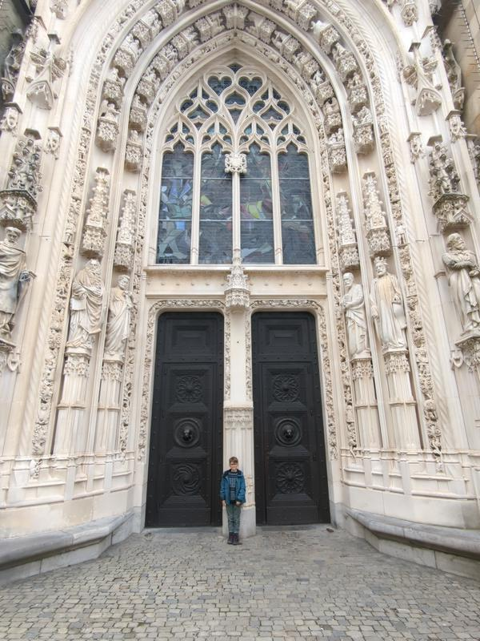

We woke up to the most amazing views! Once it was light, we found out we had a three sided balcony on the top floor (of the building!). We could see in every direction, but straight out over the lake and to the east was the most impressive. It was a bit cloudy, but we could see outlines of the mountains.

We could not get over the views and really we had no idea what was in store for us once the clouds went away. Besides half the furniture in the place being put together wrong (yes, Dan had to remake a few chairs, fix a couple lamps, etc) the place was amazing. There were 2 levels, so the kids had the entry hall turned art room, their room with a balcony and a bathroom downstairs. Upstairs was the living area, kitchen, the adults' room and bathroom. When we put the kids to bed, we almost felt like we were in an apartment without kids. Almost.

We had a big school morning and so many breaks to go outside to take in the view. Pretty chill day. Dan got home a bit sweaty due to the very uphill ride he had home from EPFL, but was loving getting back to the bike commute. As soon as he got home, I took off to go to the grocery store and found a great park on the way. I called Dan to bring the kids, but I had accidentally taken the keys with me. Why Airbnbs that have a 6 person capacity only leave one set of keys is beyond me. It happens all the time.

I walked back so they could come out. The park was on the side of a hill, basically from the upper road down to the lower one and had a super long slide. After pointing them in the right direction of the park, I took the public elevator down eight flights to where the supermarket was. Yes eight levels! I counted windows on an adjacent building.

The store was super crowded, it was 5:30pm after all, and I was just not mentally prepared to know what I should be buying. I got a conglomerate of stuff and some pre-made pizzas for dinner. Now I was down at the lower level with 2 giant grocery bags and the park was right there...well below the park was right there. I really didn't want to walk back to the elevator so I started up over 100 steps to where Dan was at the top of the slide. Kids were loving it.

Dan carried the groceries home and kids bounced happily along, especially once they saw the pizzas. One thing I am really starting to miss is having a kitchen where I can just cook whatever I want. Have all my spices, grains or sauces. Most Airbnbs have the (very) basic necessities....salt, pepper, oil...but beyond that you have to go shopping. And do I want to buy 10 different things to make something once and then just have it get wasted? I can't do it. Next to people using plastic bags when they grocery shop, food being thrown out is the worst for me. Some places we can tell that people leave things and the hosts allow it, but some places are fully cleaned out, except for the salt, pepper, etc. Not one thing in the cupboard or fridge. It's clear a lot gets wasted. It has become a total challenge on how to use up everything perishable and most shelf things before we leave a place and we have gotten quite good at it. Some days will we be eating leftover pizza for breakfast before we check out, maybe?

We have a little kit that has made it with us from place to place, so we can do some of our favorites, but every ounce of chili powder is another ounce to carry. :)

I don't know why I took this photo, but I love how lovingly Ben is looking at his yogurt. We are a yogurt loving family...the super tart, plain, fatty kind...with raw oats, nuts and bananas or apples on top. It is so easy to make and no sugar rush for the kids.

It was still a cloudy day, but 'warm' enough for snacks outside.

After a morning of school and lunch, we tried out the park two blocks from our place. Switzerland does parks right! So far what we have found are amazing wooden structures with so much climbing. This one also has a water had these cool wooden troughs that you can dam up, divert or pool the water...when the water was running in warmer weather. Lots of other kids here and Max played with all the younger kids.

Half of the park consisted of little houses in the trees and giant carved animals out of old logs.

The whole park area was great. Lots of grass areas to run around, trees to explore through. We even found 2 aviaries with so many different types of parrots and other birds. And it was very clear that spring has come to these areas of Switzerland. True we could see snow on the mountains all around us, but flowers were popping up everywhere in Lausanne.

Dan got home later after another sweaty bike ride straight up to the apartment. He loves it though. :) I left him to wrap up school with the kids and I went to the grocery store. Still not feeling in a groove with things here yet, so did lots of grabbing random stuff. Saw this and knew 2 kids and 1 husband would love it...if it's what I thought it was. The Swiss mini version of a Turducken? 

Kids insisted on cooking dinner; I think they are in it for the 'money'. We were told to leave via one door to the patio and enter through another...next to the entry sign. The cutest host came over and welcomed us. We said we were a party of two and requested to sit outside for the first course. Max was very excited to lead us to our table with a lovely view. We were served bread with balsamic and wine.

Max returned every three minutes to check on us. This I assume was due to his brothers in the kitchen trying to have some space.

The weather was amazing and we enjoyed the quiet and the time with Max. We did move inside for the main course that we shared with the chefs and host. After dinner, the kids got ready for the author's reading of a newly finished book that night. Yeah, we ran out of 'H'.

The book was awesome! We all loved it and Sam felt way too cool that he had already had a partial private reading and knew some parts coming up. Notice the chair...whoever put half the furniture together in this house did not follow directions. Dan fixed this after.

And then we celebrated the reading with hot chocolate.

The next day was a bit of the same...as were most of our days this week. School, park, dinner with Dad. The kids really wanted to play restaurant again and Dan and I keen to play the customers! Again we asked the host for an outside table with a view.

First course was some charcuterie and wine served in a mug and glass.

It almost felt like a kid-free date...almost.

The menu was extensive! We did notice it was the same from yesterday with things added. We had a choice between tomato, cucumber or regular salads...which we learned was just a regular salad with extra tomato, cucumber or lettuce respectively. We could choose between cucumber, orange or regular water. For the main course we had 'cooked meat' and veggies. Max took our order and then Sam and Ben came to also take our order while delivering more food. Dan ordered the cucumber salad and the 'cooked meat' that was the Swiss Turducken.

The sky was pretty awesome!

And it kept getting cooler...

...and cooler.

Dinner inside with the chefs and host was, once again, lovely. The Swiss Turducken was just as expected...meat in meat in meet. I wasn't a fan, but Ben loved it. After dinner we found out that at this restaurant, the customers are the ones that have to clear the table and wipe it down.

The next morning we were treated to pretty clear skies. I really couldn't get over the views. We were in this apartment for 10 days and every single day I went out on the balcony numerous times. Dan commented that I was always staring out the windows and it was true...that and sitting is still killing my back, so if I'm not actively working or eating, I'm standing or pacing the aparatment.

A bit hard to see, but there was another mountain range at the back of the valley that was pure white.

With today being Saturday, we decided to check out the Olympic Museum. There was also a running exhibit that was ending the next day and I really wanted to see it. Ben, Sam and I started out in search of a bakery while Max stayed back due to a lack of listening. We found a good one. 

We got a variety and some for Dan and Max for later. And as we have learned really quickly, Switzerland is not cheap. I knew it wasn't from traveling years ago, but being there with 3 kids, you really notice how every time you get anything you are shocked at how much you just paid.

Basically a cinnamon roll for Ben and he was in heaven.

The museum is down by the lake and the last bit of the walk as you descended down was amazing. Trees were in blossom, lake was sparkling.

The park around the entrance had a lot of sculptures and a partial track...that of course beckoned the kids to run numerous races.

Dan and Max met up with us and we headed in. Kids under 16 were free! We started in running exhibit and it does not take much to get me all emotional about running. Add some female struggles to that and I was a bit teary eyed at points.

Can you imagine running a marathon in these shorts? And winning?

There was an interactive exhibit where you could 'race' Eliud Kipchoge. You had to keep his cadence, but so you didn't cheat and just do little steps, you also had to get your knees to a certain level...and stay sort of in the same spot. We all tried and all failed.

It was done really well. Lots of mini videos about certain monumental events, blurbs on races, clothing that races were won in. Actually, the whole museum was done so well. Interactive exhibits everywhere and the kids loved it. They did a simulated biathlon where they duck hunted 5 targets and then had to run/ski in place for 20 seconds, repeat. They attempted to slalom ski, they matched flag colors to the olympic rings. And of course, they raced Dad.

Clearly Dan didn't make the top 3 and the podium.

We hit our limit and headed back home for a late lunch, with Sam and I swinging by the grocery store on the way home. It wasn't much, but the morning took it out of us. We let the kids watch a show as Dan and I both needed to tune out for a bit. Rallied later for park time and then dinner, but just wiped out.

Woke up to yet another light patter in the sky.

After breakfast, Dan and the kids got a head start park hopping while I stayed back to get work done. They had already been to three by the time I was ready to meet up with them. Dan shared his location and I walked, what seemed like, uphill the whole way to find them. And it's getting warmer everyday here. Please note in the photo that I am wearing a long sleeve shirt with NO jacket!

When I finally caught up with them, Max was on the playground and Ben and Sam were somewhere in dense trees where I could barely see them. I have found recently, that the two older kids will head to trees quickly after a quick loop through the playground. This guy still stays on the playground a bit more.

Dan had three more parks on the way, which would pass us by a bakery to get some bread to go with the lunch I packed. Every green space seemed to have more and more flowers.

Kids picked out this bread because it reminded us of the 'flower bread' from Bosnia and Herzegovina. This was not the right choice for sandwiches as some parts were so hard, it hurt to bite.

Sandwiches were still great. Can't go wrong with salami, cheese and cucumber. Pretty much a staple in this family during the last 9 months. Maybe swap out the salami for a different kind of meat or hummus, but pretty much the same.

And of course with three excited kids drooling over desserts in the bakery, we walked out with these gems.

After lunch Dan and the kids partook in a massive game of 'tag'. Well, not so much tag as Dan would steal kids' shoes and socks and put them on different parts of the play structure, so they were always trying to get them back for each other. It was hilarious to watch.

Max here is rescuing on of Ben's shoes.

After the game ended with both side claiming victory, we headed to the old town that I had wanted to check out. Passed by three more parks on the way and checked out each one a bit.

Along the walk, we also found a retaining wall that was held together in not the most conventional way. Sure gravity was holding it in place, but I'm pretty sure twisted wire is not on the approved list for construction of this manner. At least use stainless steel wire when tieing logs to a 'post' and exposed to the elements. The bent rebar connecting the logs was just pure cleverness. I guess when it's what you have on site, go with it. Just kidding...I don't suggest that!

We dropped down to the old town area and wound through streets to a cool looking building. No idea what it was, but we took a photo all the same.

Once again in old European cities, we found a cool looking fountain. Probably not a potable one this time, but just fun to look at.

And this fountain, half underground.

We made it to the cathedral and it seemed to be over 50% under construction. Before we made it to the side where we found explanations of it, we hypothesized about what parts were older, why specific parts had been fixed, but not others. It was such a mismatch and logic would say 'they fixed the parts that needed fixing' but it just didn't feel that way. I don't know why, but it did.

Ben at the entrance. The doors weighed a ton!

The interior was awesome in my opinion. Heavy on the ribbed ceilings and stained glass, light on paintings of dying Jesus. I say it all the time, well because I always think it, but how did they build this hundreds of years ago? It was stunning.

Scaffolding and catwalks for refurbishing in certain areas, but you still could get the feeling of an immense open space inside.

We stayed inside for quite a bit; everyone was enjoying the beauty. I really try to explain different religions to my kids as much as my knowledge allows. While I am an atheist (or maybe I'm just agnostic), I want them to be able to make that decision for themselves when they are old enough. So I try to not force my lack of belief, but it becomes really hard to answer some of their questions. I do put in that Mom and Dad don't believe that but many people do and who am I to be right? (Fighting urge here to state that I am always right when it comes to Dan.) I think that we stayed inside this church longer because there were no paintings of biblical scenes that spurred questions about the cross or 'what is that person doing?' and always followed by 'why?' I really struggle with these and while I think I do an okay job, sometimes it's easier to just move on. :) 

We finally popped outside and took in the view over the town below.

We walked down staircase after ramp after staircase to a very deserted lower old town. Cool looking fountain and some closed shops with Victorinox (aka Swiss Army Knives). Kids were glued to those but I managed to get one photo with an interestingly painted fountain.

Things that I wanted to see had been checked off my mental list and it had been a wonderful day. We were exhausted by this point, in need of a snack, so we headed home. With still lovely weather, we had our snack outside with more cool looking skies.

Dinner in and Sam was ecstatic that I had found canned corn.

The next day we did early school work and then back to one of the parks they had loved the day before. On the walk there, we passed the huge slide park and I gave each kid three slide turns.

The park they had wanted to to go was pretty cool. So much climbing stuff AND a public bathroom! Max stuck to the climbing for quite a while, while the other two ended up rolling around in the sand playing some game. Literally rolling around, over and over.

It was lunch time and we needed to go home. Really we had stayed too long and the handfuls of walnuts weren't cutting it. Sam lost it when we had to leave, which turned into me half dragging him home part of the way...partially because I was worried he'd try to run back, but accidentally run into passing cars. He calmed down and finally communicated more than just screaming he wanted to go back. He asked me to not hold his wrist so tightly and the second half of the walk was fine with just whimpering. By the time we were home, he was completely calm. He downed his lunch and after a bit I was able to talk to him about what happened. I know these things will still happen a lot, but this really felt like a huge win for Sam. And the rest of the day was awesome for him.

With even clearer skies, you could see further up the valley today.

I decided today was a no school day. We got up and out early to check out a park I found that was further away and to go to the lake. On the way we got some croissants so we could last longer before lunch. Once again cool wooden climbing structure, but this place was surrounded by forrest and the kids played in there most of the time. 

They found some stick structures and went to work immediately to add to them. They were on a mission to make the bigger...a serious mission dragging very large branches from all different parts. It was not going to be easy to convince them to leave, but luckily it was warm enough out that I could sit/walk around for a while to not be totally freezing. I finally decided it was time to head down to the lake...we were just 200 meters, if that, away. It was beautiful, but windy.

Two completely different skies looking west (above) and east (below).

I remember as a kid being completely entertained if I was by water. Throwing rocks or looking through rocks never got old. My kids are just the same...well, probably most kids are the same. It was too bad that it was windy, because we would have stayed so much longer. We wrapped it up and started the walk home. Along the sidewalk for as long as I could see, thousands of daffodils.

We didn't get far before the kids found a pretty good tree to climb. I really try to not be annoyed when they just want to be kids, even though I'm feeling a need to get back to our place. Some days watching them play at a playground for hours can be totally exhausting to me and I'm not even doing anything! I tried to focus on living in the moment here with zero rush and let them do their thing. Really this was one of the things that I was most excited about for our sabbatical year...lack of schedule and always feeling like we are rushing from thing to thing. Overall, I think we have done an awesome job with just going with what the day give us. But not today...I was really beat and after 10 minutes, the tiredness got the best of me and I told them we had to go.

On the walk home, we stopped at a bakery to get bread. Kids also saw this and I said it was okay to all share for dessert. The hands in the photo are due to me numerous times asking them to put a hand in a photo to get the scale of something. I guess they found it important to show the size of this, as I didn't ask for hands this time.

We made it home and I got lunch ready right away. I had found beet hummus, knowing it would be a hit. We have a joke in the family that whenever we eat beets, we say how angry Grandpa (Hohenshelt) must be because Grandpa LOVES beets and we are eating HIS beets. Well, Grandpa also loves hummus, so this was a double whammy. Sam is a hummus monster and loves beets AND loves to eat food that is supposed to be someone elses, so he pretty much shoveled the whole container into his mouth in minutes.

The next day we did the close park first thing.

We came back for school and then I pretty much let the kids do whatever they wanted for the rest of the day. I had to get work done and we were leaving the next day. Ben and Sam were secretive for a bit about what they were doing...no surprise here. Max was in a reading mood so kept close to me.

Then signs started to appear.

Turns out they had workshops set up for Max and I to do. We started with Wand Making.

Ben explained how we did it really well, helped Max and we ended up with some pretty cool wands.

And yes, still amazing views that I am going to miss so much tomorrow.

Happy customer!

Next we played Nin-Gogoe, a game that Sam created. You 'rolled a pine cone and tried to make it go up the ramp (wedge of wood) and knock over the stick.

Finally ended the event at the store where we could purchase things the kids had collected. It was fun and the kids loved it as Max and I went through it all. We capped the night off with a dinner of 'eat whatever is left in the fridge because we are moving tomorrow' and another beautiful sky.

In the morning, Dan took off to school and the kids and I packed up the last little bit and walked to the train station to have a weekend in the mountains. Dan had an afternoon meeting and he would meet us later.

