Our host met us at our place, after a super easy walk from the train station...it was all of a 200 meter walk. Kids were bouncing off the walls when they saw their room full of toys as Dan and I got a walk through of the place. I went right to unpacking and doing laundry. Dan finally peeled himself off the couch to go downstairs to a food truck to get us doner wraps and a 'side' naan. When I say 'side' I mean 13 naan for 5 euros. It took longer than I had thought to pick up dinner, but turns out they had an extra stop to get me flowers and Oreos for Mother's Day.

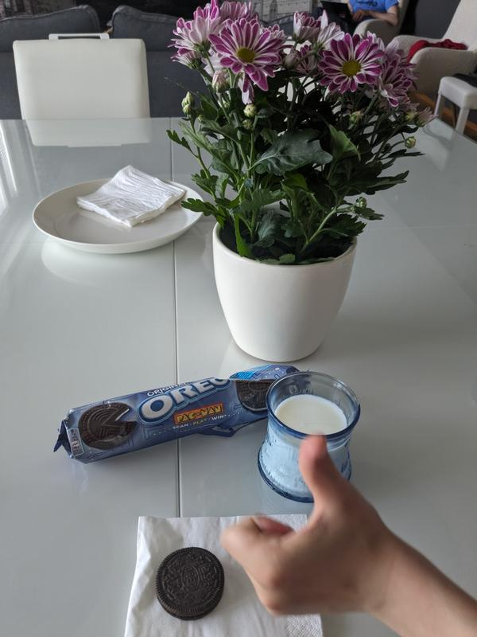

After dinner, the Ben played Dan in Star Wars chess, one of the treasures the kids found as they tour through their new room. Fun theme, sure, but really hard to remember if C3PO or or Hans Solo was the castle.

Our bikes were still at our old place in Helsinki, so the next day we rode the train there to get them back. We had left them locked up in the apartment's bike area and even though we had no key anymore, we figured someone would be walking out if we waited a bit. Instead, this happened.

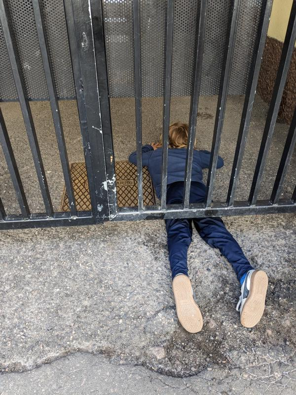

It really was a beautiful ride back, even though I was frustrated out of my mind dealing with Sam's chain that came off 3 times. Here is the first spot if fell off and where I tried to get the oil off my hands by scrubbing them with sand in the bay.

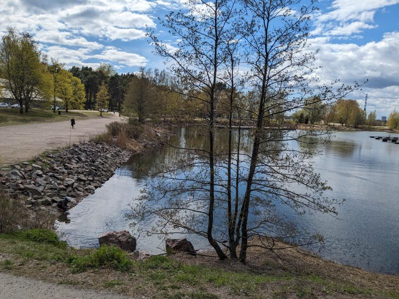

And once had twisted over itself and took me 10 minutes to fix. Dan called at this moment and I yelled at him. Not fair, but I was not in a good state. Finally going again.

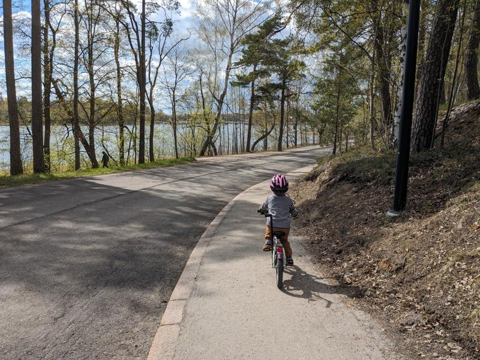

We found a park and a small changing room where I asked to use the sink to wash my hands. Happy kids, clean hands and a small snack and I was a new person.

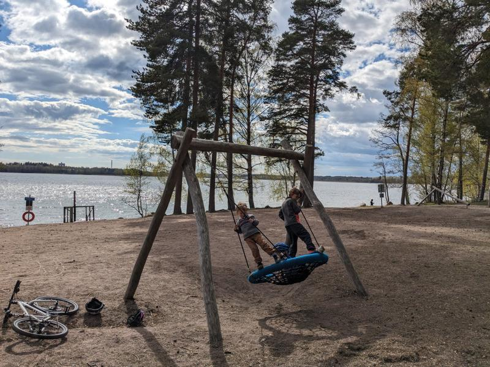

By the time we got home and met up with Dan, he was surprised at what a good mood I was in. I was so frustrated, but then just riding with the kids along the water and telling myself NO more chains would fall off, I had totally snapped out of it. I was feeling too lucky in those moments to be upset.

With the sun rising so early, warming up and us being so close to nature and paths, I tried to do more runs while we were here. Every time I go for a run, I'm so happy out there. No watch, no timing, just enjoying the freedom and frolicking (or what feels like frocking) down path after path.

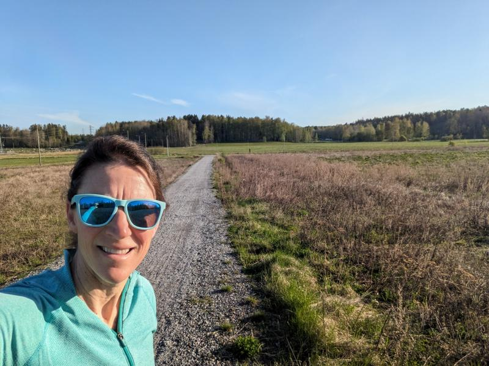

Max and Dan sporting their new shirts from Estonia.

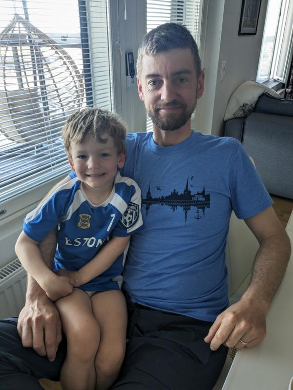

Our time in Espoo was simply amazing. We had very little to no schedule and we took advantage of exploring, now that we had Max biking SO well. We did lots of early dinners and bike rides after, Dan took the kids out on morning rides, we did afternoon rides...any chance we had, we rode our bikes. We also met a family visiting from Austin with kids the same age as ours plus a 3yo. We hung out all the time and it was amazing. The first day we met up, we biked to a park by their place. Picnic first, since the kids were so excited for friends and didn't even want to eat at home.

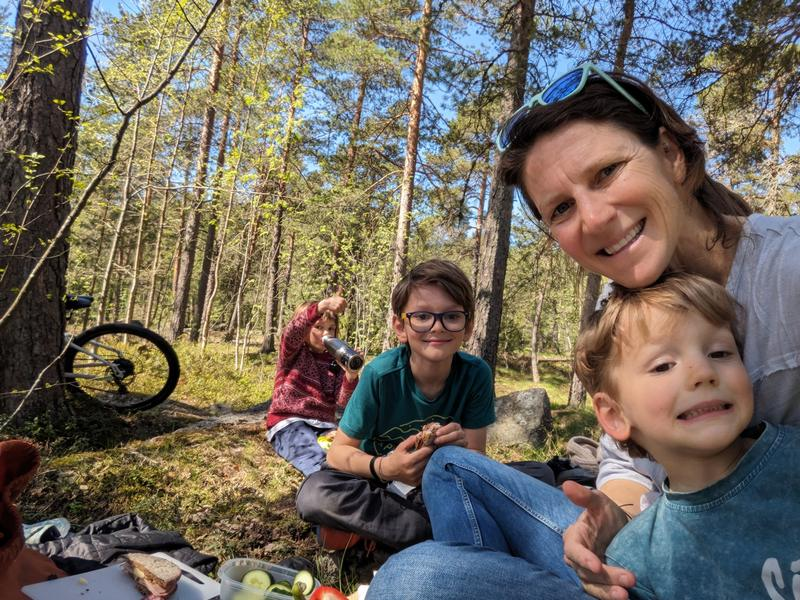

The kids played and played and played while the moms chatted non-stop. Soon my kids had showed their friends the thrill of making pure sand. That went on for a while. Dan finally met up with us as we parted ways. They were handling jet lag so well, but it as coming upon dinner time. Dan found us a pizza place on our route home and it was just what we needed. Good food and a giant area for the kids to run around while waiting for food.

The fallafal salad was great as was the pizza. The dough was cooked so perfectly well.

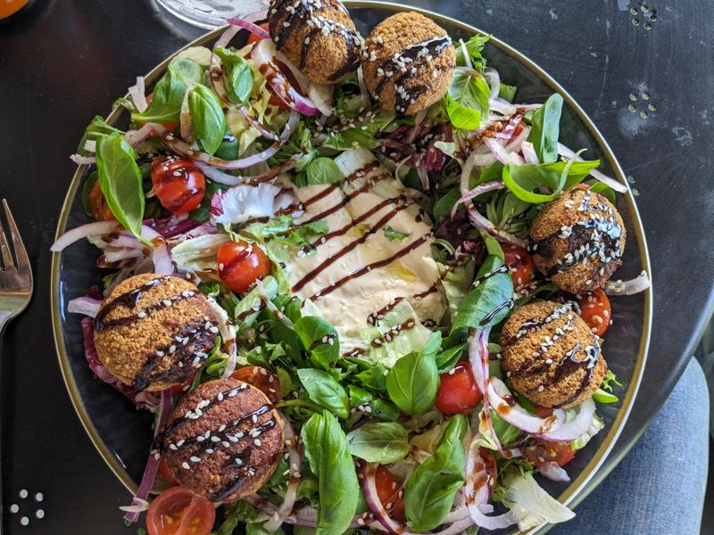

Instead of biking home, we took the super long way home along the coast to a bird watching area. Nothing like biking along a dirt path in Finland after a great dinner to put a giant smile on my face.

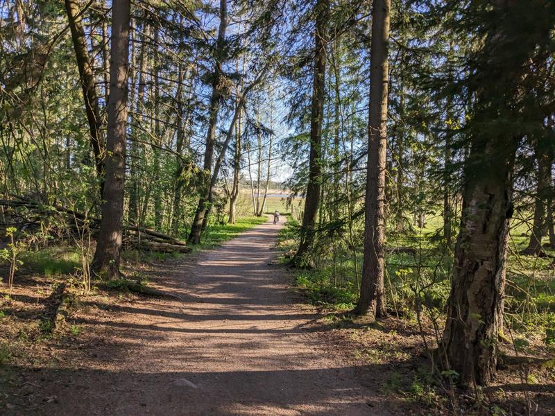

There were structures for checking out the birds and views. It had a bit of a Baylands (in Redwood City, California) feel.

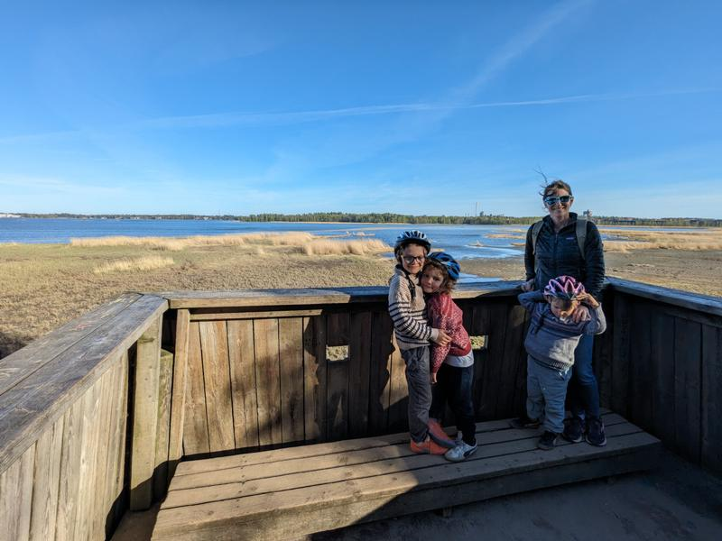

Kids were still doing their writing most mornings and I love how much Max loves talking about biking and using the word happy. I am happy that...

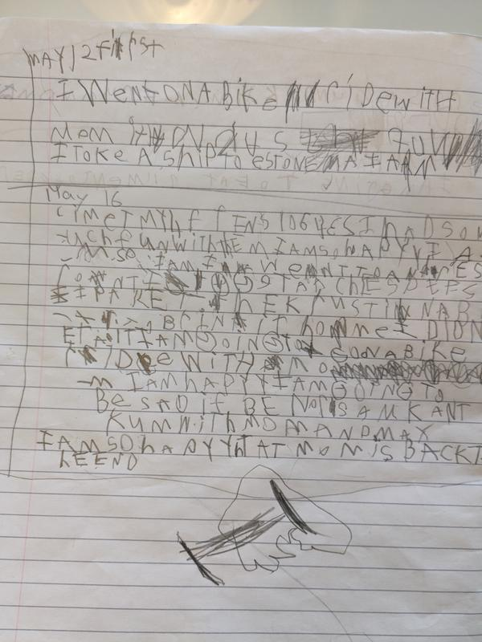

It was Thursday and after my morning work session at a cafe, I was going to continue working the rest of the day since Dan was free to be with the kids. A friend (I met her on the ship back from Stockholm) invited us to meet her at Seurasaari and I decided that would be much more fun. A lovely bike ride there and I was even picking up on the different routes by now, even though Dan was still the family navigator.

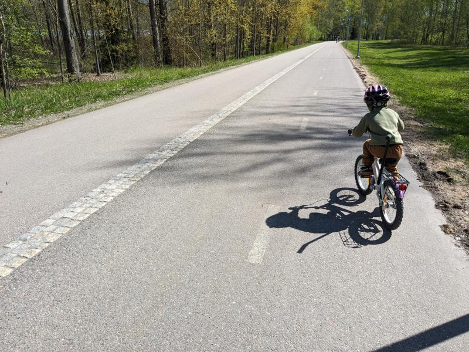

We parked our bikes right before the bridge to the island, as bikes weren't allowed. We slowly made our way across and to the manor to meet up.

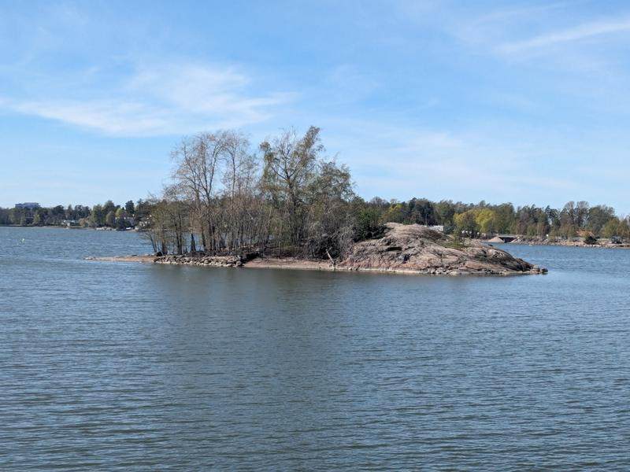

Sydney had her aunt and uncle and their friends visiting. The island was free to walk around, but you had to pay to enter the structures and we opted for the walking around for today. 

As we were there, I had a realization. For so many years, meeting up with a friend with my kids in tow, I felt I could never fully, and I mean fully, be engaged in conversation for an extended period of time. I was either taking a kid to the bathroom, being interrupted, passing out food, etc. I guess this happens at a park or something more for the kids, but not when doing more adult things. Today was amazing. The kids, with their binoculars or spy glasses, were always around, but enjoying the freedom they had. They were loving spying on us, but not so well that we could see a head or a shirt sticking out from behind a tree so we were sure we didn't lose one.

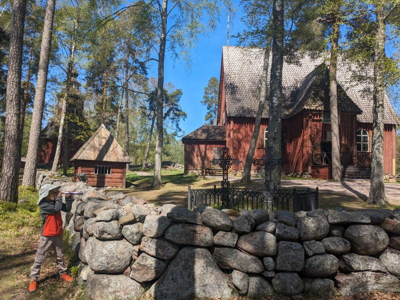
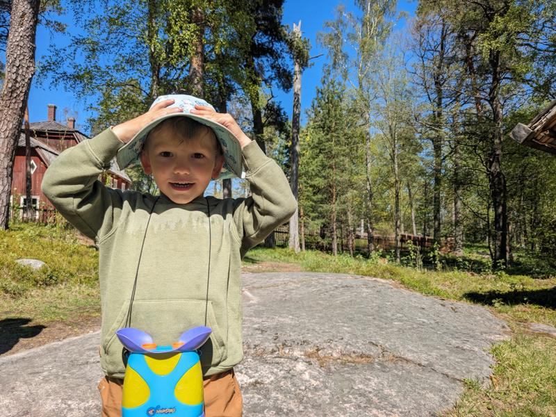

Dan and I could be so fully present while we chatted with Sydney as the kids darted around and her visitors went in the buildings. The kids were so talkative and ended up accompanying them in some of the buildings, as kids were free. They were so well behaved and, to sum it up, awesome little rock stars. 

So a bit about Seurasaari. It an open air museum on an island in the Helsinki archipelago. There are many buildings that give a view of Finnish lifestyle over the years. Traditional homes from the 18th - 20th centuries. It's a beautiful setting in a little forrest with water views.

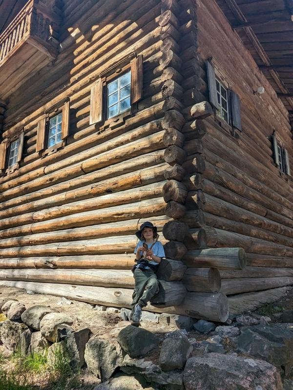

The kids loved having new people to talk to and they remembered Sydney from the ship, when Max was showing her how he could tie his shoe and do somersaults in the dining rooms. They engaged, they followed people the just met and talked and talked...when they weren't spying on us.

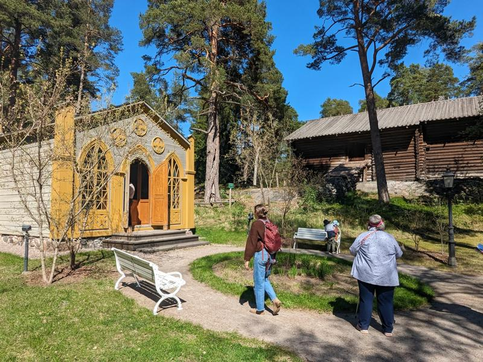

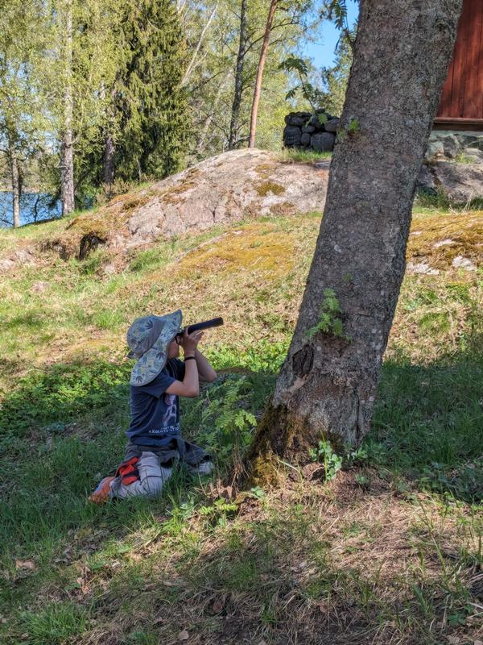

It was just so lovely. Talking with a new friend, talking with family about traveling and having a weekday with the kids when Dan could come along. It was decided it was pastry time (not sure by who, but I wasn't going to complain) so we made our way to a cafe on the island. I though food was needed, so I offered ice cream later if they went with real food. Max declined and got a donut, but Ben got a fish sandwich and Sam got a caprese one.

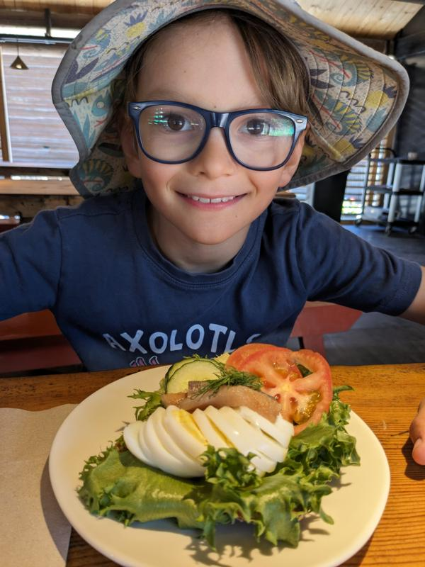

